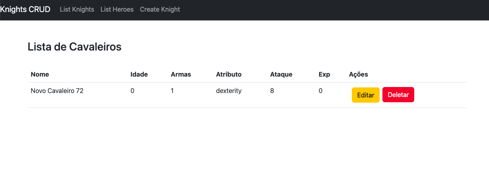

## Vue.js 3 + Nest.js (Node.js) + Typescript + Mongo + Unit / e2e Tests (cypress + jest)

### Easy Start

- Install `Docker` & `Docker Compose` (to host mongo)
- Install `Node`
- Install `yarn` (optional, by `npm install --global yarn`)

Run:

```shell
docker-compose up -d
cd backend && yarn install && cd .. && cd frontend && yarn install
```
#### To start the `Backend`:
  - `yarn run start:dev`

#### To start the `Backend`:
- `yarn run dev`

------------------------------------------

### Access by:
- Frontend: http://127.0.0.1:3000/
- Backend: http://127.0.0.1:4000/api/knights
- Mongo Express: http://127.0.0.1:8081/

------------------------------------------

### Notes:

- Changed from `/api/knights?filter=heroes` to `/api/knights?is_hero=true` to allow dynamic filters (but ensured by validation rule)
- It should, but there is no data validation in the forms (Frontend) or in the controller (with `class-validator`, etc.)
- It should, but there is no `.env` file to use
- Collection Postman `postman_collection.json` available for import

------------------------------------------

### Tests

`Frontend` (Vue.js):

1. To run the e2e (`cypress`) tests from the *command line*, run:
   - `npm run build && npm run test:e2e`
2. To view the e2e (`cypress`) tests in *visual mode*, run:
   - `npm run test:e2e:dev`

`Backend` (Nest.js):
   - *e2e*: `yarn run test:e2e`
   - *unit*: `yarn run test`

------------------------------------------

### Printscreen

